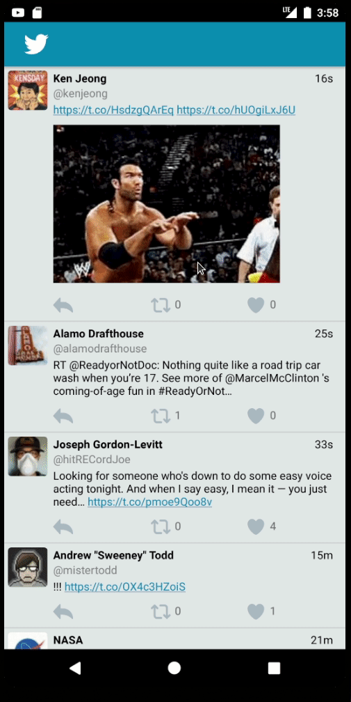

# *Tweet Away*

Tweet Away is an android app that allows a user to view his Twitter timeline. The app utilizes [Twitter REST API](https://dev.twitter.com/rest/public).

## User Stories / Functional Requirements

- User can **sign in to Twitter** using OAuth login
- User can **view tweets from their home timeline**
  - User is displayed the username, name, and body for each tweet
  - User is displayed the [relative timestamp](https://gist.github.com/nesquena/f786232f5ef72f6e10a7) for each tweet "8m", "7h"
- User can refresh tweets timeline by pulling down to refresh

- User can view more tweets as they scroll with infinite pagination
- Improve the user interface and theme the app to feel "twitter branded"
- Links in tweets are clickable and will launch the web browser
- User can tap a tweet to display a "detailed" view of that tweet
- User can see embedded image media within the tweet detail view
- On the Twitter timeline, leverage the CoordinatorLayout to apply scrolling behavior that hides / shows the toolbar.

- User can **compose and post a new tweet**
  - User can click a “Compose” icon in the Action Bar on the top right
  - User can then enter a new tweet and post this to twitter
  - User is taken back to home timeline with **new tweet visible** in timeline
  - Newly created tweet should be manually inserted into the timeline and not rely on a full refresh
  - User can **see a counter with total number of characters left for tweet** on compose tweet page

- User is using **"Twitter branded" colors and styles**
- User can click links in tweets launch the web browser 
- The "Compose" action is moved to a FloatingActionButton instead of on the AppBar
- Compose tweet functionality is build using modal overlay
- Use Parcelable instead of Serializable using the popular [Parceler library](http://guides.codepath.org/android/Using-Parceler).
- User can **open the twitter app offline and see last loaded tweets**. Persisted in SQLite tweets are refreshed on every application launch. While "live data" is displayed when app can get it from Twitter API, it is also saved for use in offline mode.

## Video Walkthroughs

Here's a walkthrough of implemented user stories:

### Login and Home Timeline
 

### Toolbar Collapse on Scroll
 

### Swipe to Refresh
 

### Clickable Links, Tweet Detail View, Embedded Media, Infinite Scroll!
 

 

## Notes

- Still working on embedded video media.  Struggling with 3rd party libraries.  Also, seems video media can still be labelled "photo" in the twitter API?  May have to use extended entities and search for "video" under type.  Seems videos still have a "photo" type in the simple media entity?

## Open-source libraries used

- [Android Async HTTP](https://github.com/codepath/CPAsyncHttpClient) - Simple asynchronous HTTP requests with JSON parsing
- [Glide](https://github.com/bumptech/glide) - Image loading and caching library for Android
